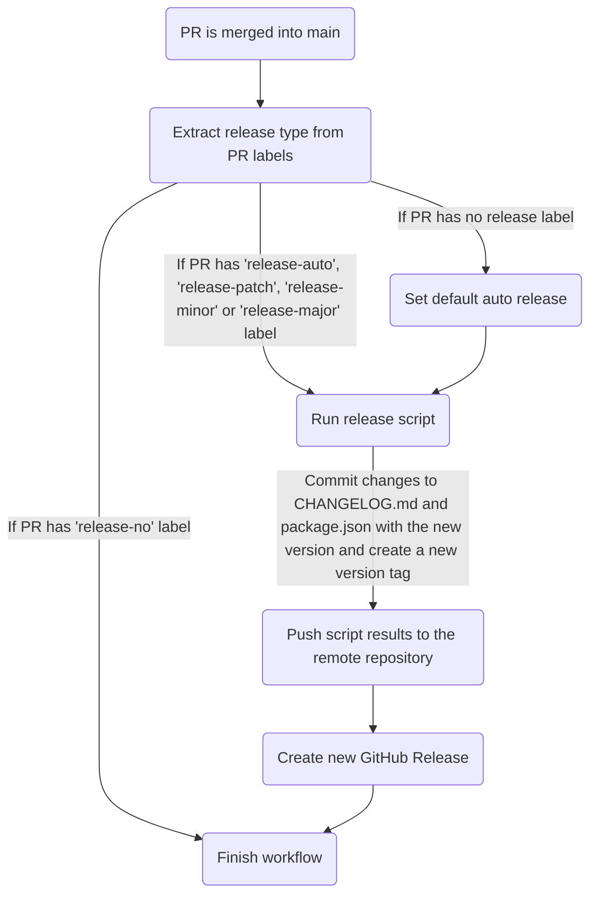
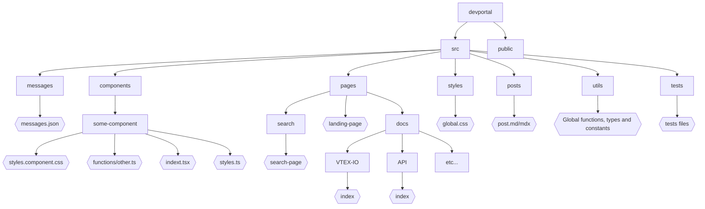

# Developers Portal

## Summary 

- [About](#about)
  - [Objective](#objective)
  - [Concepts and Features](#concepts-and-features)
- [Versioning](#versioning)
- [Tests](#tests)
- [Development](#development)
  - [Project Pattern](#project-pattern)
    - [Directory Tree](#directory-tree)
    - [React Preferences](#react-preferences)
    - [Code Linting and Format](#code-linting-and-format)
  - [Commits](#commits)
  - [Branches](#branches)
    - [Feature Branches](#feature-branches)
- [Contributing](#contributing)
  - [Scenario: I want to develop and propose a new contribution](#scenario-i-want-to-develop-and-propose-a-new-contribution)
  - [Scenario: Someone updated the `main` branch, and I'm developing something on my *feature branch*](#scenario-someone-updated-the-main-branch-and-im-developing-something-on-my-feature-branch)


## About

### Objective
This repository implements the new VTEX Developers Portal with better navigability, content centralization and search facility to improve developers experience as they consult our applications documentation, guides and API references.

### Concepts and Features
As the Developer Portal provides VTEX documentation to users, some of its main features are:
- OpenAPI documentations rendering

  The [OpenAPI](https://www.openapis.org/) specification was chosen by VTEX to generate its API references guides since it defines a standard interface to describe RESTful APIs, as well as it can be easily understood, consumed and rendered by tools like [ReadMe](https://readme.com/) (used in the initial Developers Portal).
- Markdown files rendering

  [Markdown](https://www.markdownguide.org/) is a very popular markup language that helps making plaintext documents more semantic by adding formatting elements defined in its syntax. VTEX developers and many tech writers reccur to Markdown to write documentation, including those served by the Developers Portal.

## Versioning

The versioning process of this repository was built to automate version releases and standardize its contributions. The following goals are currently implemented:
- Standardize the repository history by adopting a commit messaging convention that make commits more semantic

  [Commitlint](https://commitlint.js.org/#/) is a tool that lints commit messages according to Conventional Commits. [Conventional Commits](https://www.conventionalcommits.org/en/v1.0.0/), on the other hand, is based on the [SemVer (Semantic-Versioning)](https://semver.org/) standard.

- Automate `CHANGELOG.md` and `package.json` version updates based on semantic commit messages, as well as the creation of new version tags

  [Standard Version](https://github.com/conventional-changelog/standard-version) provides a release script that results in a release commit containing a new version in `package.json` and updates in `CHANGELOG.md`, all based on the changes introduced by the latest semantic commits. It also creates a new version tag.

- Automate new version releases when Pull Requests (PR) are merged into the `main` branch
 
  A GitHub action named **Release Version Workflow** is triggered whenever a PR is merged into the `main` branch. The action's workflow is represented by the diagram below, its steps identify whether the PR should release a new version - and of what type - to run the release script, push its results and generate a new GitHub Release corresponding to the new version tag. The type of the new version may be automatically deducted from the semantic commits or determined by the user as a PATCH, MINOR or MAJOR.



## Tests

- Performance tests on desktop and mobile devices
  
  [Lighthouse](https://github.com/GoogleChrome/lighthouse) is a tool that analyzes web apps and web pages to collect performance metrics and insights on developer best practices. To avoid significant performance drops introduced by Pull Requests, a pair of GitHub actions using [Lighthouse CI](https://github.com/GoogleChrome/lighthouse-ci) are running against PRs to collect the performance metrics of the code with the proposed changes at desktop and mobile devices (a report containing the results is hosted on a URL that is availaible at the end of the actions log).

- Automated tests

  [Cypress](https://www.cypress.io/) is an automated testing tool that was added to the repository so pre-defined E2E or unitary tests (inside cypress directory) will be executed whenever a PR is opened.

## Development

Clone this repo, access the command line at its root directory and install all dependencies:

```bash
yarn install
```

To start the application development server, run:

```bash
yarn dev
```

Open [http://localhost:3000](http://localhost:3000) with your browser to see the result.

### Project Pattern

The Developers Portal is a [Next.js](https://nextjs.org/) app based on [React](https://reactjs.org/) and [Typescript](https://www.typescriptlang.org/).

#### Directory tree

The diagram below represents the base structure defined to organize the files and folders of the repository, where all file names must follow the kebab-case convention.



#### React preferences

- It is preferable to use **arrow functions**
- It is preferable to use **functional components** instead of class components
- It is preferable to use **Hooks** over Higher Order Components (HOCs)

#### Code linting and format

- [ESLint](https://eslint.org/) is used to lint code and identify errors based on a pre-defined ruleset (`.eslintrc.json` file)

    Before any change is committed, a pre-commit hook will run the ESLint on JavaScript and TypeScript files located at pre-defined paths (such as `src/pages`, `src/components` etc) to fix their errors (ignored paths are described in `.eslintignore`).

- [Prettier](https://prettier.io/) is used to standardize the code formatting based on a pre-defined ruleset (`.prettierrc` file)

    Before any change is committed, a pre-commit hook will run Prettier and correct errors found in the appropriate files (ignored paths are included in `.prettierignore`).

You might want to configure ESLint and Prettier in your code editor to see errors and correction suggestions at development time.

### Commits

By simplicity, we have three types of commits:
- __*commits*__: commits made by the user 
- __*merge commits*__: commits through the command `git merge <branch> --no-ff` (it is also generated when merging a Pull Request without squashing)
- __*release commits*__: commits using [Standard Version](https://github.com/conventional-changelog/standard-version) tool

[Standard Version](https://github.com/conventional-changelog/standard-version) is a tool that simplifies the versioning process of a project. It has a release script that creates a __*release commit*__ containing a new version in `package.json`, updates in `CHANGELOG.md` based on changes introduced by the latest __*commits*__ and a new version tag.

Because the `CHANGELOG.md` changes applied by the __*release commit*__ are automatically generated based on the [Conventional Commits](https://conventionalcommits.org/) convention, supported by [Semantic Versioning](https://semver.org/), the __*commits*__ messages should be written in English following the model:
```
<type>[optional scope]: <description>

[optional body]

[optional footer(s)]
```

A `BREAKING CHANGE` may be present in any type of commit, and is represented by a commit message that has a footer `BREAKING CHANGE: <description>`, or by a commit message that appends a `!` after the type/scope, which introduces a breaking API change (correlating with a __MAJOR*__ release in Semantic Versioning).

The `<scope>` may specify the context of the applied changes (e.g. subject, component or file name), as well as the `<body>` may help explaning in more details the commit.

If you wish some help to write your commits, don't hesitate to use the [Commitizen](https://github.com/commitizen/cz-cli) script: it provides an interactive step-by-step way of generating descriptions that follow the defined model via command line. You only have to run `yarn cz-commit` instead of `git commit`.

Commit `<type>` Options | Description | Release*
-----|-------------|---------------
`fix` | fixes bugs in your codebase | PATCH
`feat` | introduces a new feature to the codebase | MINOR
`docs` | documentation only changes | PATCH
`style` | changes that do not affect the meaning of the code (white-space, formatting, missing semi-colons, etc) | PATCH
`refactor` | a code change that neither fixes a bug nor adds a feature | PATCH
`perf` | a code change that improves performance | PATCH
`test` | adds missing tests or corrects existing tests | PATCH
`build` | changes that affect the build system or external dependencies (scope examples: gulp, broccoli, npm) | PATCH
`ci` | changes to CI configuration files and scripts (scope examples: Travis, Circle, BrowserStack, SauceLabs) | PATCH
`chore` | other changes that don't modify src or test files | PATCH
`revert` | changes that revert previous commits | PATCH


__* [SemVer specification says the MAJOR version zero (0.y.z) is for initial development](https://semver.org/#spec-item-4). Because of this, until this repository reaches a first stable version of the Developers Portal (with a specified major release), the automatic release won't lead to any MAJOR version, but only PATCH and MINOR (breaking changes commits will result in MINOR bumps).__


**Examples:**
```bash
# Commit message without scope, body, footer or breaking change
chore: add favicon

# Commit message with scope
ci(versioning): add Release-Version GitHub workflow

# Commit message with scope and breaking change
feat(api)!: send an email to user when a request is submitted

# Commit message with breaking change (footer)
chore: drop support for Node 6

BREAKING CHANGE: use JavaScript features not available in Node 6.
```

**What *not* to do:**
- Add dot in the end of text Ex: "Update React Router."
- Start with uppercase
- Write in Portuguese

### Branches

Currently, we have one fixed branch: `main` .

The `main` branch must reflect exactly what is deployed in production, it should be treated as __*the single source of truth*__. It is from `main` where every development branch is created.

**Important note:** Only *merge commits* should be made by developers on `main` branch.

#### Feature branches

You must create a branch based on `main` to start a feature, improvement, or fix. This branch is called a *feature branch*. It must have the following structure name: `<type>/<description>`
The `types` are the same described at [Commits](#commits) section.
 
The *feature branch* description must be short and written with kebab-case. It should give a basic understanding of what is being developed on the branch.

Ex: `git checkout -b feature/landing-page`.

**Important note:** Only *commits* should be made in a *feature branch*. None *release or merge commits* should be made.

## Contributing

### Scenario: I want to develop and propose a new contribution

- **Step 1.** Create a *feature branch* based on `main`.
    ```sh
    git checkout main
    git checkout -b feature/nice-new-thing
    ```

- **Step 2.** Develop the improvement in this *branch* making commits (see [Commits](#commits) section if you have questions on how to write your commit message).

    ```sh
    git commit -m "feat: add nice new thing"
    ```

- **Step 3.** Push your *feature branch* to the remote repository (in the following example represented by the *origin* alias)

    ```sh
    git push origin feature/nice-new-thing
    ```

- **Step 4.** Open a Pull Request (PR), select its reviewers and add it one of the release labels:

    Release Labels | Description | Release Type
    ---------------|-------------|-------------
    `release-no` | When no new version should be released when the PR is merged into the `main` branch | None
    `release-auto` | When the new version to be released should be deducted automatically based on the PR semantic commits when it is merged (see [Commits](#commits) section) | [PATCH, MINOR, MAJOR]
    `release-patch` | When the new version should be released as a patch | PATCH
    `release-minor` | When the new version should be released as a minor | MINOR
    `release-major` | When the new version should be released as a major | MAJOR

    **Important:** If none of the labels are added, a version release corresponding to `release-auto` will be triggered.

- **Step 5.** Verify if your Pull Request passed all checks that run against opened Pull Requests. In case any of them fails, look for a solution and update your *feature branch*.

    **Important:** If your branch has been updated with new commits, you should request new reviews to your PR.

- **Step 6.** When your PR has been approved by reviewers, make sure your feature branch is still rebased on the `main` branch. If it needs to be rebased, run:

    ```bash
    # Bring to local main branch the remote main latest updates
    git checkout main
    git pull origin main

    # Checkout your feature branch and rebase it onto main (solve possible conflicts)
    git checkout feature/new-nice-thing
    git rebase main

    # Force push your rebased feature branch
    git push --force origin feature/new-nice-thing
    ```
    
    Go back to **Step 5**.

    **Important:** If your rebase process generated conflicts, new reviews must be requested.

- **Step 7.** After your PR has been rebased onto `main`, passed all checks and been approved by reviewers, click on **Merge Pull Request** option. This way all commits from the *feature branch* will be added to the base branch via a merge commit and their semantic messages will be considered to update `CHANGELOG.md` and release a new version.

- **Step 8.** The merged PR, if set to release a new version in **Step 4**, will trigger a GitHub action that results in a new commit `chore(release): v*.*.*`, a new version tag and its corresponding GitHub Release. Verify those changes in the repository initial page. Wait for the build in Netlify to end and your released version will be deployed.

- **Step 9.** Celebrate! You have just finished your contribution to the VTEX Developers Portal repository.

### Scenario: Someone updated the `main` branch, and I'm developing something on my *feature branch*

Make *rebase* of your *feature branch* on `main`:

```bash
# Bring to local main branch the remote main latest updates
git checkout main
git pull origin main

# Checkout your feature branch and rebase it onto main (solve possible conflicts)
git checkout feature/new-nice-thing
git rebase main

# Force push your rebased feature branch
git push --force origin feature/new-nice-thing
```

**Important** Always maintain your *feature branch* rebased on `main`.
