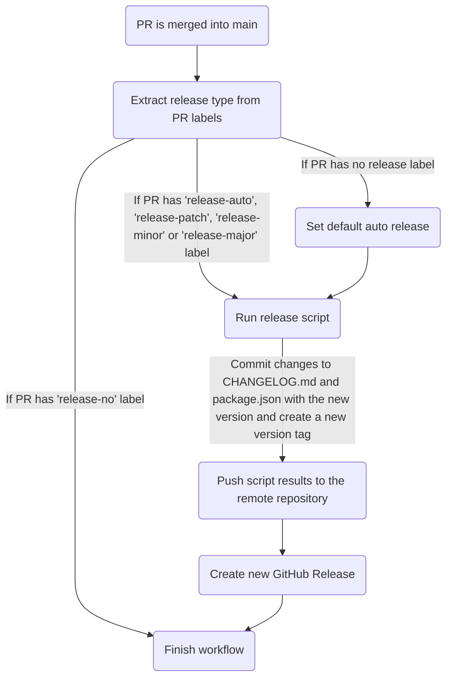
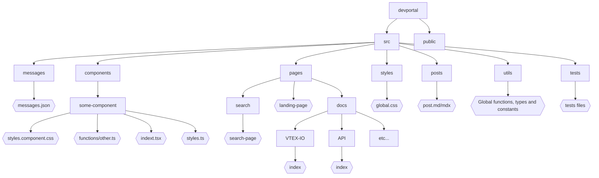

# Developers Portal

## Summary 

- [About](#about)
  - [Objective](#objective)
  - [Concepts and Features](#concepts-and-features)
  - [Caching Structure for Technical Writers](#caching-structure-for-technical-writers)
- [Versioning](#versioning)
- [Tests](#tests)
- [Development](#development)
  - [Project Pattern](#project-pattern)
    - [Directory Tree](#directory-tree)
    - [React Preferences](#react-preferences)
    - [Code Linting and Format](#code-linting-and-format)
  - [Commits](#commits)
    - [How to make a commit](#how-to-make-a-commit)
  - [Branches](#branches)
    - [Feature Branches](#feature-branches)
  - [Docker development environment](#docker-development-environment)
- [GitHub Actions](#github-actions)
  - [Integration and Component Tests](#integration-and-component-tests-cypressyml)
  - [Release Version](#release-version-release-versionyml)
  - [Verify PR Labels](#verify-pr-labels-verify-pr-labelsyml)
  - [Extensive Tests](#extensive-tests-cypress-extensiveyml)
  - [DocSearch Scraper](#docsearch-scraper-docsearch-scraperyml)
  - [Lighthouse Mobile](#lighthouse-mobile-lighthouse-mobileyml)
  - [Lighthouse Desktop](#lighthouse-desktop-lighthouse-desktopyml)
- [Contributing](#contributing)
  - [How to develop and propose a new contribution](#how-to-develop-and-propose-a-new-contribution)
  - [What to do when someone updated the `main` branch and I'm developing something on my *feature branch*](#what-to-do-when-someone-updated-the-main-branch-and-im-developing-something-on-my-feature-branch)


## About

### Objective
This repository implements the new VTEX Developers Portal with better navigability, content centralization and search facility to improve developers experience as they consult our applications documentation, guides and API references.

### Concepts and Features
As the Developer Portal provides VTEX documentation to users, some of its main features are:
- OpenAPI documentations rendering

  The [OpenAPI](https://www.openapis.org/) specification was chosen by VTEX to generate its API references guides since it defines a standard interface to describe RESTful APIs, as well as it can be easily understood, consumed and rendered by tools like [ReadMe](https://readme.com/) (used in the initial Developers Portal).
- Markdown files rendering

  [Markdown](https://www.markdownguide.org/) is a very popular markup language that helps making plaintext documents more semantic by adding formatting elements defined in its syntax. VTEX developers and many tech writers reccur to Markdown to write documentation, including those served by the Developers Portal.
- GitHub API Integration with Rate Limit Handling
  
  The portal uses GitHub's API through Octokit to fetch documentation content. To handle GitHub API rate limits gracefully:
  - Configurable retry mechanism with max retries and timeout
  - Automatic fallback to raw.githubusercontent.com when API limits are hit
  - Smart throttling to prevent excessive API calls

### Caching Structure for Technical Writers

The Developer Portal uses Netlify's CDN and caching infrastructure to optimize performance. When updating documentation, technical writers should be aware of how caching affects the visibility of their changes:

#### OpenAPI Documentation Caching

When you update an OpenAPI specification file in the GitHub repository:

1. **Cache Duration**: 
   - Updated specs will be visible after the cache expires, typically:
     - Primary source (jsdelivr): 5 minutes (300 seconds)
     - Fallback source (GitHub raw): 3 minutes (180 seconds)
   - A stale-while-revalidate period of up to 15 minutes may follow

2. **Cache Invalidation Options**:
   - **Automatic Expiration**: Wait for the cache to naturally expire (~5 minutes)
   - **Manual Purging**: For urgent updates, you can request cache purging via Netlify's Cache Purge API using cache tags:
     ```bash
     curl -X POST "https://api.netlify.com/api/v1/sites/{site-id}/builds/cache" \
       -H "Authorization: Bearer {access-token}" \
       -H "Content-Type: application/json" \
       -d '{"cache_tags": ["openapi,spec-name"]}'
     ```

3. **Debugging Cache Status**:
   - The API response includes debugging headers to help track cache status:
     - `X-Source`: Shows which source provided the spec (jsdelivr or github-raw)
     - `X-References-Resolved`: Indicates if spec references were resolved
     - `X-Cache-Debug`: Contains source, resolution status, and TTL information

4. **Testing Updates**:
   - To verify changes immediately without waiting for cache expiration:
     - Add a unique query parameter to force a cache miss: `?v=timestamp`
     - Request cache purging from your development team

Understanding this caching structure helps set appropriate expectations for when documentation updates will become visible to users.

## Versioning

The versioning process of this repository was built to automate version releases and standardize its contributions. The following goals are currently implemented:
- Standardize the repository history by adopting a commit messaging convention that makes commits more semantic

  [Commitlint](https://commitlint.js.org/#/) is a tool that lints commit messages according to Conventional Commits. [Conventional Commits](https://www.conventionalcommits.org/en/v1.0.0/), on the other hand, is based on the [SemVer (Semantic-Versioning)](https://semver.org/) standard.

- Automate `CHANGELOG.md` and `package.json` version updates based on semantic commit messages, as well as the creation of new version tags

  [Standard Version](https://github.com/conventional-changelog/standard-version) provides a release script that results in a release commit containing a new version in `package.json` and updates in `CHANGELOG.md`, all based on the changes introduced by the latest semantic commits. It also creates a new version tag.

- Automate new version releases when Pull Requests (PR) are merged into the `main` branch
 
  A GitHub action named **Release Version Workflow** is triggered whenever a PR is merged into the `main` branch. The action's workflow is represented by the diagram below, its steps identify whether the PR should release a new version - and of what type - to run the release script, push its results and generate a new GitHub Release corresponding to the new version tag. The type of the new version may be automatically deducted from the semantic commits or determined by the user as a PATCH, MINOR or MAJOR.



## Tests

- Performance tests on desktop and mobile devices
  
  [Lighthouse](https://github.com/GoogleChrome/lighthouse) is a tool that analyzes web apps and web pages to collect performance metrics and insights on developer best practices. To avoid significant performance drops introduced by Pull Requests, a pair of GitHub actions using [Lighthouse CI](https://github.com/GoogleChrome/lighthouse-ci) are running against PRs to collect the performance metrics of the code with the proposed changes at desktop and mobile devices (a report containing the results is hosted on a URL that is availaible at the end of the actions log).

- Automated tests

  [Cypress](https://www.cypress.io/) is an automated testing tool that was added to the repository so pre-defined E2E or unitary tests (inside cypress directory) will be executed whenever a PR is opened.

### Cypress Tests

The Cypress tests are designed to ensure the functionality and stability of the Developers Portal. The tests cover four main areas:

1. **Documentation Pages Status Tests**
   - Randomly selects and verifies the loading status of documentation pages
   - Includes retry mechanisms for both run mode (3 retries) and open mode (3 retries)
   - Logs any failed page checks for debugging purposes

2. **API Reference Documentation Tests**
   - Verifies sidebar functionality:
     - Tests the collapse/expand button behavior
     - Confirms sidebar visibility states
   - Tests navigation:
     - Verifies random guide page loading through sidebar navigation
     - Ensures proper URL patterns for API reference pages
   - Validates content:
     - Checks for presence of API documentation title
     - Tests response tab functionality and content visibility

3. **API Guides Documentation Tests**
   - Verifies sidebar functionality:
     - Tests the collapse/expand button behavior
     - Confirms sidebar visibility states
   - Tests navigation:
     - Verifies random guide page loading through sidebar navigation
     - Ensures proper URL patterns for guide pages
   - Validates content and features:
     - Checks for presence of guide titles
     - Tests document contributor links (verifies GitHub redirects)
     - Validates feedback system:
       - Tests feedback section visibility
       - Verifies feedback modal functionality
       - Tests feedback submission process
     - Tests table of contents navigation:
       - Verifies all headings are properly linked
       - Tests navigation to the last section
       - Validates scroll behavior

4. **Component Tests**
   - **MarkdownRenderer Component**:
     - Tests basic markdown content rendering without FastStore integration
     - Verifies FastStore component documentation:
       - Tests proper rendering of component props sections
       - Validates component attribute display
     - Handles edge cases:
       - Gracefully handles missing component documentation
       - Tests mixed content with both markdown and FastStore components
   - **DropdownMenu Component**:
     - Tests section rendering in different modes
     - Verifies content visibility and interaction
   - **Contributors Component**:
     - Tests avatar display and GitHub profile links
     - Validates contributor information rendering

#### What to Expect in Terms of Reports

After the Cypress tests are executed, a summary report is generated. The report includes:

- The total number of tests that failed
- Detailed information about each failing test, including:
  - Test title and description
  - The specific URL where the test failed
  - The error message and stack trace

The summary report is posted as a comment on the Pull Request, providing a quick overview of the test results.

#### How to Deal with Errors

If any tests fail, follow these steps to address the issues:

1. **Review the Summary Report:** Check the summary report posted on the Pull Request to identify the failing tests and the specific errors encountered.
2. **Reproduce the Errors Locally:** Run the Cypress tests locally to reproduce the errors and investigate the root cause.
3. **Fix the Issues:** Make the necessary code changes to fix the issues identified by the failing tests.
4. **Re-run the Tests:** After fixing the issues, re-run the Cypress tests locally to ensure that the errors have been resolved.
5. **Push the Changes:** Push the changes to the remote repository and verify that the Cypress tests pass in the CI environment.

To run the Cypress tests locally, use the following command:

```bash
yarn cypress:open
```

To run the Cypress tests in the CI environment, use the following command:

```bash
yarn cypress:run
```

This command will run the Cypress tests in the CI environment and generate the necessary reports.

## Development

Clone this repo, access the command line at its root directory and install all dependencies:

```bash
yarn install
```

To start the application development server, run:

```bash
yarn dev
```

Open [http://localhost:3000](http://localhost:3000) with your browser to see the result.

### Project Pattern

The Developers Portal is a [Next.js](https://nextjs.org/) app based on [React](https://reactjs.org/) and [Typescript](https://www.typescriptlang.org/).

#### Directory tree

The diagram below represents the base structure defined to organize the files and folders of the repository, where all file names must follow the kebab-case convention.



#### React preferences

- It is preferable to use **arrow functions**
- It is preferable to use **functional components** instead of class components
- It is preferable to use **Hooks** over Higher Order Components (HOCs)

#### Code linting and format

- [ESLint](https://eslint.org/) is used to lint code and identify errors based on a pre-defined ruleset (`.eslintrc.json` file)

    Before any change is committed, a pre-commit hook will run the ESLint on JavaScript and TypeScript files located at pre-defined paths (such as `src/pages`, `src/components` etc) to fix their errors (ignored paths are described in `.eslintignore`).

- [Prettier](https://prettier.io/) is used to standardize the code formatting based on a pre-defined ruleset (`.prettierrc` file)

    Before any change is committed, a pre-commit hook will run Prettier and correct errors found in the appropriate files (ignored paths are included in `.prettierignore`).

You might want to configure ESLint and Prettier in your code editor to see errors and correction suggestions at development time.

### Commits

By simplicity, we have three types of commits:
- __*commits*__: commits made by the user 
- __*merge commits*__: commits through the command `git merge <branch> --no-ff` (it is also generated when merging a Pull Request without squashing)
- __*release commits*__: commits using [Standard Version](https://github.com/conventional-changelog/standard-version) tool

  [Standard Version](https://github.com/conventional-changelog/standard-version) is a tool that simplifies the versioning process of a project. It has a release script that generates a new version tag and creates a __*release commit*__ containing: a new version in `package.json` and updates in `CHANGELOG.md` based on changes introduced by the latest __*commits*__.

#### How to make a commit

- **Step 1.** Stage the desired changes:
  ```bash
  git add <filenames>
  ```
- **Step 2.** Commit your staged files:
  - **Option 1:** Use the [Commitizen](https://github.com/commitizen/cz-cli) script to make your **commit** with an interactive step-by-step via command line that helps generating semantic descriptions that follow the [Conventional Commits](https://www.conventionalcommits.org/en/v1.0.0/) model. Instead of runing `git commit`, run the command below and follow the instructions that will appear:
    ```bash
    yarn cz-commit
    ```
  - **Option 2:** Make your **commit** manually following the [Conventional Commits](https://www.conventionalcommits.org/en/v1.0.0/) model:
    ```
    <type>[optional scope]: <description>

    [optional body]

    [optional footer(s)]
    ```

    If there are any breaking changes introduced by your changes, follow one of the options:
    - Append a `!` after `<type>[optional scope]`
      ```
      <type>[optional scope]!: <description>

      [optional body]

      [optional footer(s)]
      ```
    - Add `BREAKING CHANGE: < breaking change description>` to the footer
      ```
      <type>[optional scope]: <description>

      [optional body]

      BREAKING CHANGE: <breaking change description>
      ```

    The `<scope>` may specify the context of the applied changes (e.g. subject, component or file name), as well as the `<body>` may help explaning the commit in more details. The `<type>` helps making commit messages more semantic and all options are described in the table below.

    <a href="commit-types-table" id="commit-types-table"></a>
    Commit `<type>` Options | Description | Release*
    -----|-------------|---------------
    `fix` | fixes bugs in your codebase | PATCH
    `feat` | introduces a new feature to the codebase | MINOR
    `docs` | documentation only changes | PATCH
    `style` | changes that do not affect the meaning of the code (white-space, formatting, missing semi-colons, etc) | PATCH
    `refactor` | a code change that neither fixes a bug nor adds a feature | PATCH
    `perf` | a code change that improves performance | PATCH
    `test` | adds missing tests or corrects existing tests | PATCH
    `build` | changes that affect the build system or external dependencies (scope examples: gulp, broccoli, npm) | PATCH
    `ci` | changes to CI configuration files and scripts (scope examples: Travis, Circle, BrowserStack, SauceLabs) | PATCH
    `chore` | other changes that don't modify src or test files | PATCH
    `revert` | changes that revert previous commits | PATCH


    __* [SemVer specification says the MAJOR version zero (0.y.z) is for initial development](https://semver.org/#spec-item-4). Because of this, until this repository reaches a first stable version of the Developers Portal (with a specified major release), the automatic release won't lead to any MAJOR version, but only PATCH and MINOR (breaking changes commits will result in MINOR bumps).__


    **Examples:**
    ```bash
    # Commit message without scope, body, footer or breaking change
    chore: add favicon

    # Commit message with scope
    ci(versioning): add Release-Version GitHub workflow

    # Commit message with scope and breaking change
    feat(api)!: send an email to user when a request is submitted

    # Commit message with breaking change (footer)
    chore: drop support for Node 6

    BREAKING CHANGE: use JavaScript features not available in Node 6.
    ```

  **What *not* to do:**
  - Add dot in the end of text. E.g.: `chore: add favicon.`
  - Start with uppercase
  - Write in Portuguese

### Branches

Currently, we have one fixed branch: `main` .

The `main` branch must reflect exactly what is deployed in production, it should be treated as __*the single source of truth*__. It is from `main` where every development branch is created.

>**Important note:** Only *merge commits* should be made by developers on `main` branch.

#### Feature branches

You must create a branch based on `main` to start a feature, improvement, or fix. This branch is called a *feature branch*. It must have the following structure name: `<type>/<description>`
Choose the `type` that best summarizes your contribution at the [Commit Types Table](#commit-types-table).
 
The *feature branch* description must be short and written with kebab-case. It should give a basic understanding of what is being developed on the branch.

E.g.: `git checkout -b feature/landing-page`.

>**Important note:** Only *commits* should be made in a *feature branch*. None *release or merge commits* should be made.

### Docker development environment

To run the application using Docker, follow these steps:

1. Ensure you have Docker and Docker Compose installed on your machine.
2. Build and start the Docker containers using Docker Compose:
    ```bash
    docker compose up --build
    ```
3. Open [http://localhost:3000](http://localhost:3000) with your browser to see the result.

For Windows users:
- If you encounter issues with file watching, you may need to enable polling by uncommenting the `WATCHPACK_POLLING=true` line in the `docker-compose.yml` file.

```dockercompose
version: "3.8"
services: 
  frontend:
    container_name: frontend
    build:
      context: . #if your Dockerfile is not at the same level change the path here (./frontend)
      target: dev
    restart: always
    command: yarn dev
    environment:
      - NODE_ENV=development 
      #if you're using Windows, you may need to uncomment the next line - Sol from @Kobe E
      #- WATCHPACK_POLLING=true
    volumes:
      - .:/devportal
    ports:
      - 3000:3000
```

## GitHub Actions

The repository uses several GitHub Actions to automate various processes. Below is a detailed description of each action:

### Integration and Component Tests (`cypress.yml`)

This action runs Cypress tests on pull requests to ensure code quality and functionality.

**Dependencies:**
- `actions/checkout@v3`: Checks out the repository code
- `actions/setup-node@v3`: Sets up Node.js environment with version 18
- `cypress-io/github-action@v5`: Runs Cypress tests
- `fountainhead/action-wait-for-check@v1.1.0`: Waits for Netlify preview deployment
- `jakepartusch/wait-for-netlify-action@v1.4`: Ensures Netlify preview is accessible
- `wei/curl@v1`: Fetches navigation data
- `thollander/actions-comment-pull-request@v2`: Posts test results as PR comments

### Release Version (`release-version.yml`)

Automates version releases when pull requests are merged into the main branch.

**Dependencies:**
- `de-vri-es/setup-git-credentials@v2`: Sets up Git credentials
- `actions/checkout@v3`: Checks out the repository code
- `actions/create-release@v1`: Creates GitHub releases

### Verify PR Labels (`verify-pr-labels.yml`)

Validates pull request labels to ensure proper versioning.

**Dependencies:**
- `jesusvasquez333/verify-pr-label-action@v1.4.0`: Validates PR labels

### Extensive Tests (`cypress-extensive.yml`)

Runs comprehensive Cypress tests on demand.

**Dependencies:**
- `actions/checkout@v1`: Checks out the repository code
- `wei/curl@v1`: Fetches navigation data
- `cypress-io/github-action@v5`: Runs Cypress tests

### DocSearch Scraper (`docsearch-scraper.yml`)

Updates Algolia search index when pull requests are merged.

**Dependencies:**
- `actions/checkout@v2`: Checks out the repository code
- `vtexdocs/devportal-docsearch-action@main`: Updates Algolia search index

### Lighthouse Mobile (`lighthouse-mobile.yml`)

Runs Lighthouse performance tests on mobile devices for pull requests.

**Dependencies:**
- `actions/checkout@v1`: Checks out the repository code
- `actions/setup-node@v1`: Sets up Node.js environment
- `kamranayub/wait-for-netlify-action@2.0.0`: Waits for Netlify preview

### Lighthouse Desktop (`lighthouse-desktop.yml`)

Runs Lighthouse performance tests on desktop devices for pull requests.

**Dependencies:**
- `actions/checkout@v1`: Checks out the repository code
- `fountainhead/action-wait-for-check@v1.1.0`: Waits for Netlify preview deployment
- `jakepartusch/wait-for-netlify-action@v1.4`: Ensures Netlify preview is accessible
- `actions/github-script@v6`: Executes GitHub API scripts
- `treosh/lighthouse-ci-action@v10`: Runs Lighthouse tests
- `thollander/actions-comment-pull-request@v2`: Posts test results as PR comments

## Contributing

### How to develop and propose a new contribution

- **Step 1.** Create a *feature branch* based on `main` (follow the naming pattern defined at [Feature Branches](#feature-branches) section).
    ```bash
    git checkout main
    git checkout -b feature/nice-new-thing
    ```

- **Step 2.** Develop the contribution in your *feature branch* by making commits (see [How to make a commit](#how-to-make-a-commit) section).

    ```bash
    git add <filenames>
    git commit -m "feat: add nice new thing"
    ```

- **Step 3.** Push your *feature branch* to the remote repository (in the following example represented by the *origin* alias)

    ```bash
    git push origin feature/nice-new-thing
    ```

- **Step 4.** Open a Pull Request (PR), select its reviewers and add it one of the release labels:

    Release Labels | Description | Release Type
    ---------------|-------------|-------------
    `release-no` | When no new version should be released when the PR is merged into the `main` branch | None
    `release-auto` | When the new version to be released should be deducted automatically based on the PR semantic commits when it is merged | [PATCH, MINOR, MAJOR]
    `release-patch` | When the new version should be released as a patch | PATCH
    `release-minor` | When the new version should be released as a minor | MINOR
    `release-major` | When the new version should be released as a major | MAJOR

    >**Important note:** If none of the labels are added, a version release corresponding to `release-auto` will be triggered.

- **Step 5.** Verify if your Pull Request passed all checks that run against opened Pull Requests. In case any of them fails, look for a solution and update your *feature branch*.

    >**Important note:** If your branch has been updated with new commits, you should request new reviews to your PR.

- **Step 6.** When your PR has been approved by reviewers, make sure your feature branch is still rebased on the `main` branch. If it needs to be rebased, run:

    ```bash
    # Bring to local main branch the remote main latest updates
    git checkout main
    git pull origin main

    # Checkout your feature branch and rebase it onto main (solve possible conflicts)
    git checkout feature/new-nice-thing
    git rebase main

    # Force push your rebased feature branch
    git push --force origin feature/new-nice-thing
    ```
    
    Go back to **Step 5**.

    >**Important note:** If your rebase process generated conflicts, new reviews must be requested.

- **Step 7.** After your PR has been rebased onto `main`, passed all checks and been approved by reviewers, click on **Merge Pull Request** option (the one that generates a merge commit). This way all commits from the *feature branch* will be added to the base branch and their semantic messages will be considered to update `CHANGELOG.md` when releasing a new version.

- **Step 8.** The merged PR, if set to release a new version in **Step 4**, will trigger a GitHub action that results in a new commit `chore(release): v*.*.*`, a new version tag and its corresponding GitHub Release (see [Versioning](#versioning) section for more details) - you can verify those changes in the repository initial page after the workflow has finished. Wait for the build in Netlify to end and your released version will be deployed.

- **Step 9.** Celebrate! You have just finished your contribution to the VTEX Developers Portal repository.

### What to do when someone updated the `main` branch and I'm developing something on my *feature branch*

Make *rebase* of your *feature branch* on `main`:

```bash
# Bring to local main branch the remote main latest updates
git checkout main
git pull origin main

# Checkout your feature branch and rebase it onto main (solve possible conflicts)
git checkout feature/new-nice-thing
git rebase main

# Force push your rebased feature branch
git push --force origin feature/new-nice-thing
```

>**Important note:** Always maintain your *feature branch* rebased on `main`.
